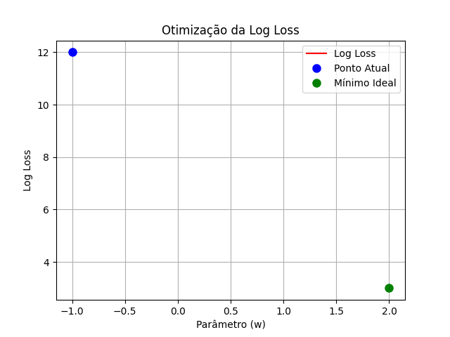

# Visualização da Otimização da Log Loss com Animação

[](https://opensource.org/licenses/MIT)

Este projeto apresenta uma visualização animada do processo de otimização de uma função de **log loss**, frequentemente utilizada em modelos de classificação probabilística. A animação mostra como o parâmetro `w` é ajustado para minimizar o erro da função, destacando o comportamento da curva de perda e o ponto de mínimo ideal.

## 🚀 Demonstração

Assista à animação que ilustra o processo de otimização da Log Loss:

<p align="center">
  
</p>

## Objetivo

Demonstrar, de forma didática e visual, o processo de otimização de uma função de custo (log loss), que é fundamental no treinamento de modelos de Machine Learning.

A visualização é útil para:
- Entender como os algoritmos ajustam seus parâmetros para reduzir o erro
- Ilustrar o comportamento de funções convexas
- Apresentar o conceito de ponto de mínimo ideal
- Criar materiais educacionais e apresentações

## Sobre o Projeto

O notebook `Projeto_Animacao_Log_Loss.ipynb` contém o código completo para simular e visualizar a otimização de uma função de log loss. Ao executar o notebook, a animação será gerada e salva no formato GIF na pasta `media/` do projeto (como `log_loss_optimization.gif`).

## 💻 Tecnologias Utilizadas

- **Python**: A linguagem de programação principal para o desenvolvimento do projeto.
- **NumPy**: Biblioteca para manipulação de arrays e operações matemáticas, essencial para a simulação de dados e cálculos da função de perda.
- **Matplotlib**: Utilizada para a geração de gráficos e animações. O módulo `matplotlib.animation.FuncAnimation` é fundamental para criar a animação da otimização.
- **SciPy**: A biblioteca `scipy.optimize` é empregada para encontrar o ponto de mínimo da função de perda, simulando um algoritmo de otimização.
- **Pillow**: Necessária para o Matplotlib salvar a animação no formato GIF.
- **Jupyter Notebook**: Ambiente de desenvolvimento interativo que permite combinar código Python, visualizações e texto explicativo, ideal para explorar e apresentar o conceito de otimização.

## 🚀 Como Executar

Para rodar este projeto em seu ambiente local, siga os passos abaixo:

1.  **Clone o repositório**:

    ```bash
    git clone [https://github.com/SeuNomeDeUsuario/Projeto_Animacao_Log_Loss.git](https://github.com/SeuNomeDeUsuario/Projeto_Animacao_Log_Loss.git)
    cd Projeto_Animacao_Log_Loss
    ```
    (Lembre-se de substituir `SeuNomeDeUsuario` pelo seu username do GitHub)

2.  **Instalar as dependências**:
    Recomenda-se criar um ambiente virtual para gerenciar as dependências.

    ```bash
    python -m venv venv
    source venv/bin/activate  # No Windows, use `venv\Scripts\activate`
    pip install -r requirements.txt
    ```

3.  **Rodar o Código**:
    Abra o notebook `Projeto_Animacao_Log_Loss.ipynb` em um ambiente Jupyter Notebook ou Jupyter Lab e execute as células.

    ```bash
    jupyter notebook Projeto_Animacao_Log_Loss.ipynb
    ```

    Após a execução, a animação será exibida no próprio notebook e salva na pasta `media/` do projeto.

## 🤝 Contribuições

Contribuições são bem-vindas! Se você tiver ideias para melhorias, novas funcionalidades ou encontrar algum problema, sinta-se à vontade para abrir uma *issue* ou enviar um *pull request*.

## 📄 Licença

Este projeto está licenciado sob a Licença MIT - veja o arquivo [LICENSE.md](LICENSE.md) para mais detalhes.

## 📧 Contato

Se você tiver alguma dúvida ou sugestão, entre em contato:

* **Nome**: Flávio Henrique Barbosa
* **LinkedIn**: [Flávio Henrique Barbosa | LinkedIn](https://www.linkedin.com/in/fl%C3%A1vio-henrique-barbosa-38465938)
* **Email**: flaviohenriquehb777@outlook.com

---
